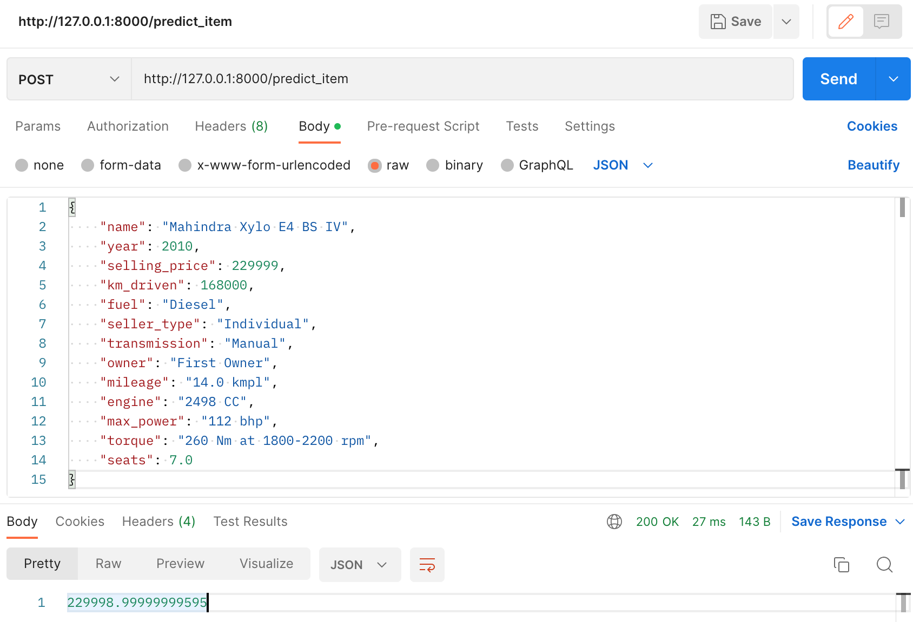
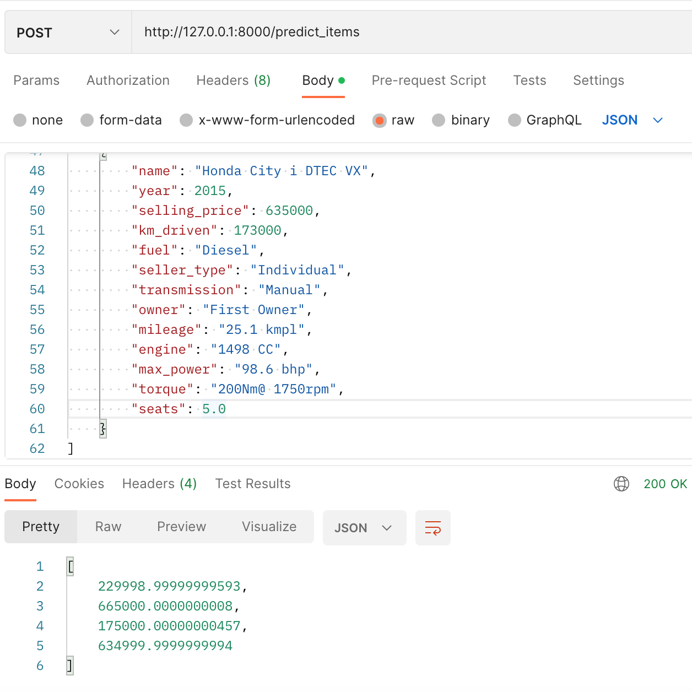
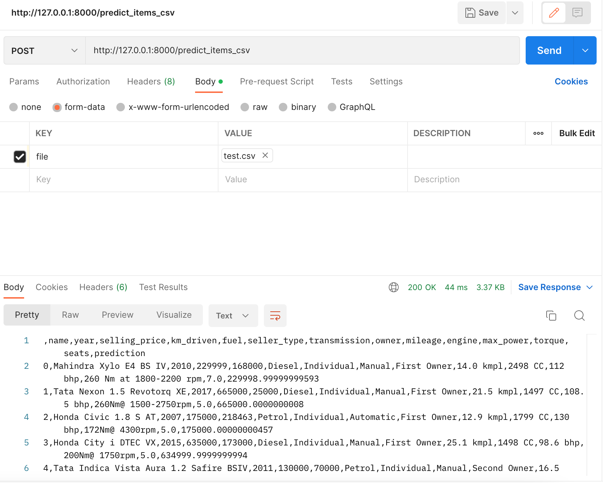

Домашние задания

### Результаты работы

1. Сделал основную часть ДЗ, также получилось сделать часть по FastAPI
   
2. * Для удобного инференса модели написал пайплайн, в котором аггрегировал всю обработку входных данных
   * Лучшая модель оказалась Ridge regression с One Hot кодированием категориальных признаков, Метрика R2 = 0.66, 0.64
    на трейне и тесте
     
3. Наибольшего прироста достиг при использовании категориальных признаков

4. Не успел сделать дополнительные интересные задания с регулярками, feature engineering, ввиду ограниченного времени 
постарался уделить больше времени наименее известной теме для меня - разработке пайплайнов и приложения FastAPI
   
5. Скриншоты:

   

